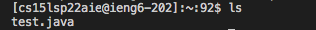
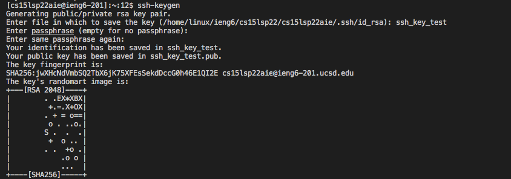
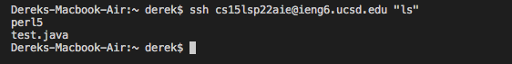

# Week 2 Lab Report

## Installing VScode
Go to [https://code.visualstudio.com/](https://code.visualstudio.com/). Here you should follow the instructions on how to download VScode.

## Remotely Connecting
If you are on Windows, you will have to download OpenSSH. Since I only use macOS, I will not show it in this tutorial.

First, open the terminal in VSCode ("Terminal" -> "New Terminal"). Type in the command below.

`ssh 'YOUR_COURSE_SPECIFIC_USERNAME'@ieng6.ucsd.edu`

Lookup your username via [https://sdacs.ucsd.edu/~icc/index.php](https://sdacs.ucsd.edu/~icc/index.php). Once done entering your password in the terminal. You should see the same result as shown below.

## Trying Some Commands
Here are some useful commands. Try it out.
* `pwd`: print working directory
* `ls`: list files
* `cp`: copy
* `mv`: move or rename
* `cd`: change directory
* `mkdir`: make directory
* `rm`: remove
* `cat`: view or create a file
* `touch`: create a file
* `man`: display command manual

To log out from the remote server. 
* Crtl+D
* Or enter `exit` in the terminal

## Moving Files with scp
We use `scp` to copy a file from your computer to a remote computer. Create a file with `test.java` and put some contents of your choice into it. Then run the following command in the terminal.

`scp test.java 'YOUR_COURSE_SPECIFIC_USERNAME'@ieng6.ucsd.edu:~/`

When you enter `ls` in the terminal, the file should appear in your ieng6 home directory.

## Setting an SSH Key
Run command `ssh-keygen`

`Generating public/private rsa key pair.`

`Enter file in which to save the key (/Users/<user-name>/.ssh/id_rsa): /Users/<user-name>/.ssh/id_rsa`

`Enter passphrase (empty for no passphrase):`

`Enter same passphrase again:`

`Your identification has been saved in "file"`

`Your public key has been saved in "file".pub.`

`The key fingerprint is:`

`...`

`logout`

enter `ssh-keygen` again in your local computer same as above

Now copy the public key to the .ssh directory of your user account on the server.

`scp /Users/<user-name>/.ssh/id_rsa.pub cs15lsp22zz@ieng6.ucsd.edu:~/.ssh/authorized_keys`

Now, you should be able to login without having to enter your password

## Optimizing Remote Running
You can run a command in quotes after the `ssh` command and it will exit on it own.
Here are a few ways of entering
* `ssh 'YOUR_COURSE_SPECIFIC_USERNAME'@ieng6.ucsd.edu "ls"`
* or use semicolon, `cp test.java OtherMain.java; javac OtherMain.java; java test`
* Use up-arrow to recall last command for easier access

