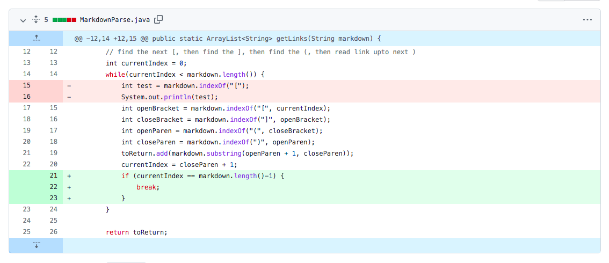
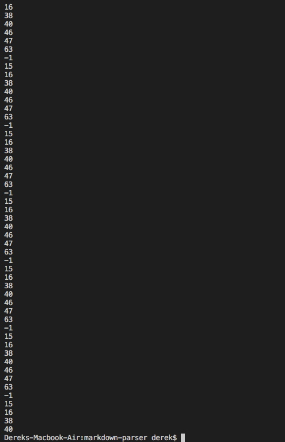
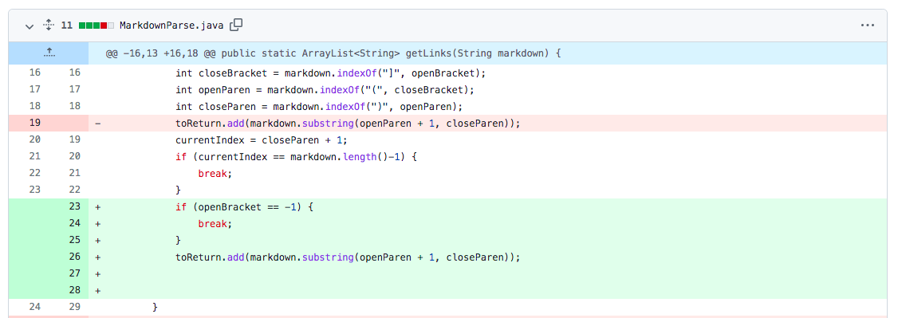
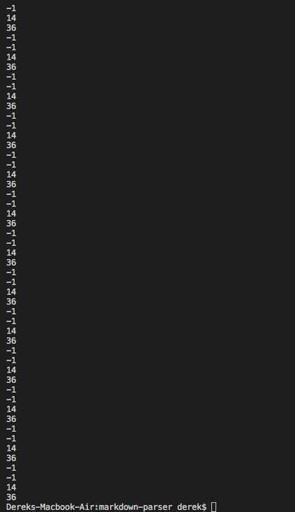
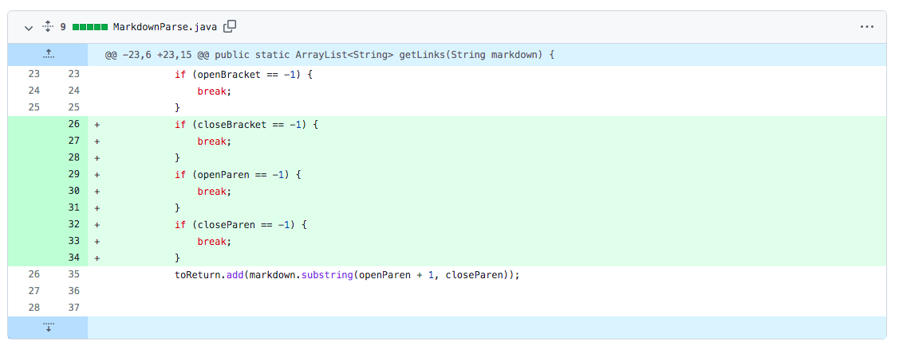
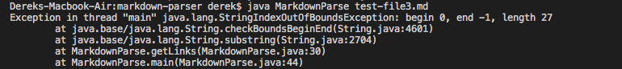

# Lab report 2 week 4

## 1st code changes

The error is caused by a empty line in the [test file](https://github.com/derekcheung11/markdown-parser/blob/08024d8cb75c7d8dd68fb98aaed1683a83220ffa/test-file.md) and creates a endless loop. I created a if statement to check and breaks when it reaches the end.

## 2nd code changes

This error is caused by missing square bracket in the [test file](https://github.com/derekcheung11/markdown-parser/blob/08024d8cb75c7d8dd68fb98aaed1683a83220ffa/test-file9.md). Since it will output -1 if square bracket is missing. So I made a if statement to break the loop.

## 3rd code changes

This error is caused by missing round bracket in the [test file](https://github.com/derekcheung11/markdown-parser/blob/08024d8cb75c7d8dd68fb98aaed1683a83220ffa/test-file3.md). Since it will output -1 if round bracket is missing. So I made a if statement to break the loop.
