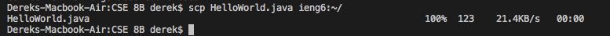
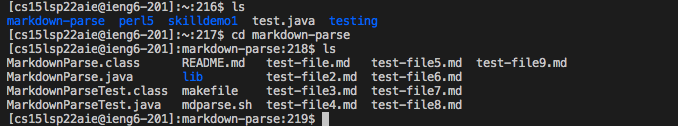

# Lab report 3 week 6

## Streamlining ssh Configuration
.ssh/config file

command I used to edit the config file

ssh command loggin me into my account using just the alias

scp command copying a file to my account using just the alias

## Setup Github Access from ieng6
screenshot of where the public key is stored on github

screenshot of where the private key is stored on my user account

git status

## Copy whole directories with scp -r
copying my whole markdown-parse directory to my ieng6 account

logging into my ieng6 account and compiling/running the tests for my repository

combining scp, ; and ssh to copy the whole directory (testing) and run the tests in one line

