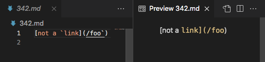

# Lab report 5 week 10

Q: How you found the tests with different results

> A: I did it by using `vimdiff my-markdown-parser/results.txt cse15lsp22-markdown-parser/results.txt`. The different results will be highlighted as shown below.

[342.md](https://github.com/nidhidhamnani/markdown-parser/blob/main/test-files/342.md)

Neither of the implementation are correct as shown below.

The actual output for 342.

As seen here, the implementation did not take backtick to an account and printed out what's in the round bracket. Adding an if statement to check for the presents of backtick would help.

[472.md](https://github.com/nidhidhamnani/markdown-parser/blob/main/test-files/472.md)

the output of cse15lsp22-markdown-parser implementation to 472 is correct as it prints out the url.

The actual output for 472.

The implementation for my-markdown-parser should not check for star symbol. Add an if statement to ignore star symbol.