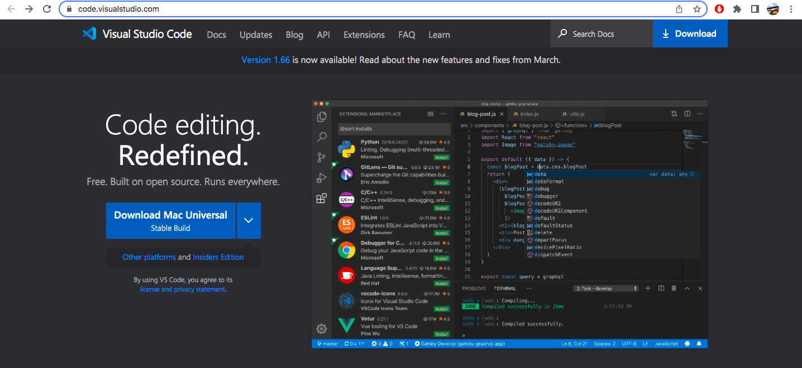
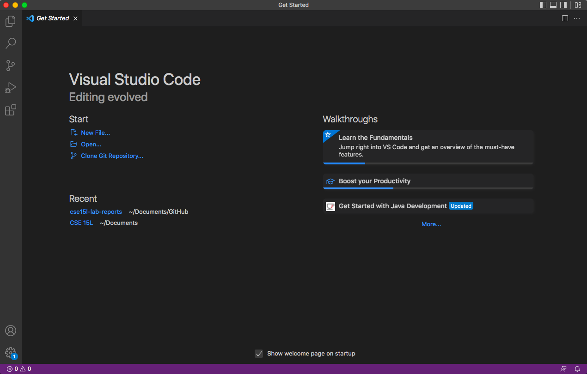
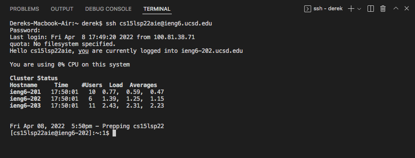

# Week 2 Lab Report

## Installing VScode
Go to https://code.visualstudio.com/. Here you should follow the instruction on how to download VScode.

## Remotely Connecting
If you are on Windows, you will have to download OpenSSH. Since I only uses macOS, I will not show it in this tutorial.

First, open terminal in VSCode ("Terminal" -> "New Terminal menu option"). Type in the command below.

`ssh 'YOUR_COURSE_SPECIFIC_USERNAME'@ieng6.ucsd.edu`

Lookup your account username via https://sdacs.ucsd.edu/~icc/index.php. Once done entering your password in the terminal. You should see the same result as shown below.

## Trying Some Commands
Here is a list of some commands. Try it out.
* cd
* ls: list files
* cat: view or create a file

To log out from the remote server. 
* Crtl+D
* Or enter `exit` in the terminal

## Moving Files with scp
We use `scp` to copy a file from your computer to a remote computer. Create a file with `test.txt` and put some contents of your choice into it. Then run this command in the terminal.

`scp test.txt 'YOUR_COURSE_SPECIFIC_USERNAME'@ieng6.ucsd.edu:~/`

When you enter `ls` in the terminal, it should show the file in your ieng6 home directory.

: /Users/<user-name>/.ssh/id_rsa`

`Enter passphrase (empty for no passphrase):`

Note: Make sure that you do not add a passphrase for this step.
`Enter same passphrase again:`

`Your identification has been saved in /Users/<user-name>/.ssh/id_rsa.`

`Your public key has been saved in /Users/<user-name>/.ssh/id_rsa.pub.
The key fingerprint is:`

`SHA256:jZaZH6fI8E2I1D35hnvGeBePQ4ELOf2Ge+G0XknoXp0 <user-name>@<system>.local`
`The key's randomart image is:`

`+---[RSA 3072]----+
|                 |
|       . . + .   |
|      . . B o .  |
|     . . B * +.. |
|      o S = *.B. |
|       = = O.*.*+|
|        + * *.BE+|
|           +.+.o |
|             ..  |
+----[SHA256]-----+`

![Image](

## Optimizing Remote Running
You can run a command in quotes after the `ssh` command and exit right after it.
Here are a few ways of entering
* `ssh 'YOUR_COURSE_SPECIFIC_USERNAME'@ieng6.ucsd.edu "ls"`
* `cp WhereAmI.java OtherMain.java; javac OtherMain.java; java WhereAmI`
* Use up-arrow to recall last command for easier access

![Image](

