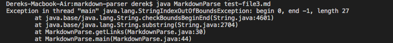

# Lab Report 2
## 1st code changes

The error is caused by a empty line in the test file 1 and creates a endless loop. I created a if statement to check and breaks when it reaches the end.

## 2nd code changes

This error is caused by missing square bracket in the test file 9. Since it will output -1 if square bracket is missing. So I made a if statement to break the loop.

## 3rd code changes

This error is caused by missing round bracket in the test file 3. Since it will output -1 if round bracket is missing. So I made a if statement to break the loop.
